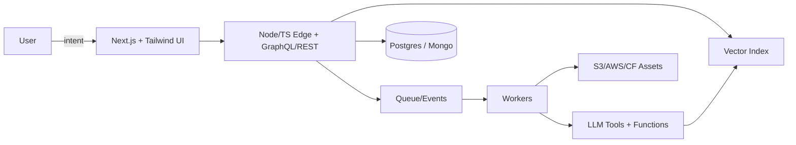

# File: README.md
<!-- ╔═════════════════════════════════════════════════════════════════╗
     ║  Brian Lockhart — Profile README (Live, Self-Updating)         ║
     ╚═════════════════════════════════════════════════════════════════╝ -->

<h1 align="center">Brian Lockhart</h1>
<p align="center"><em>Architecting adaptive systems • Full-Stack & AI • Building engines that learn</em></p>

<p align="center">
  <a href="https://www.linkedin.com/in/brianlockhart-deviscript/">LinkedIn</a> •
  <a href="https://bio.site/brianlockhart">Bio</a> •
  <a href="mailto:DeviScript@gmail.com">Email</a>
</p>

---

## Prime Directive
Software shouldn’t sit still. I design **autonomous, composable systems**—apps that **adapt**, pipelines that **learn**, and products that **monetize themselves**.

- Interfaces: **React/Next.js** with kinetic UI and typed contracts  
- Systems: **Node.js/TypeScript/Python**, evented and observable  
- Data plane: **PostgreSQL, MongoDB, Redis, Supabase**  
- Cognition: **LLM orchestration, embeddings, retrieval, toolchains**  
- Delivery: **AWS, Docker, Cloudflare, CI/CD**, latency as a feature

---

## Architecture Snapshot


---

## Project Nodes
- **DeviScript** — modular automation core for AI-first content + commerce  
- **Neural Layers** — multi-agent chat with contextual memory and graph logic  
- **Synthwave** — generative UI components that self-style with runtime heuristics

---

## Signal Log (auto-generated)
> This section is rewritten by a GitHub Action on a schedule. No external services.

### Weekly Pulse
<!-- SIGNAL:PULSE:START -->
_awaiting first run…_
<!-- SIGNAL:PULSE:END -->

### Recent Repositories
<!-- SIGNAL:REPOS:START -->
_awaiting first run…_
<!-- SIGNAL:REPOS:END -->

### Language Mix
<!-- SIGNAL:LANGUAGES:START -->
_awaiting first run…_
<!-- SIGNAL:LANGUAGES:END -->

---

## Credentials (brief)
- **UNC–Chapel Hill × edX** — Full-Stack Web Development (24-week intensive)
- Hands-on across algorithms, DS&A, testing, and real-world deployments

---

## Contact
**Build with me.**  
LinkedIn • Bio • Email above.

<!-- End of README -->


# File: .github/workflows/readme-dynamic.yml
name: Update README (Live Signals)

on:
  schedule:
    - cron: "17 */8 * * *"   # every 8 hours at :17 (staggered)
  workflow_dispatch: {}
  push:
    paths:
      - "scripts/update-readme.mjs"

permissions:
  contents: write

jobs:
  update:
    runs-on: ubuntu-latest
    steps:
      - name: Checkout
        uses: actions/checkout@v4

      - name: Use Node.js
        uses: actions/setup-node@v4
        with:
          node-version: "20"

      - name: Run updater
        env:
          GH_TOKEN: ${{ secrets.GITHUB_TOKEN }}
          REPO_OWNER: ${{ github.repository_owner }}
        run: |
          node --version
          node scripts/update-readme.mjs

      - name: Commit changes (if any)
        run: |
          if [[ -n "$(git status --porcelain)" ]]; then
            git config user.name "github-actions[bot]"
            git config user.email "41898282+github-actions[bot]@users.noreply.github.com"
            git add README.md
            git commit -m "chore(readme): refresh live signals"
            git push
          else
            echo "No changes."
          fi


# File: scripts/update-readme.mjs
/**
 * Update README "Signal Log" using only GitHub API + Node built-ins.
 * - Weekly Pulse: commits/pushes & PRs in last 7 days
 * - Recent Repositories: latest 5 repos you pushed to
 * - Language Mix: Mermaid pie from summed language bytes across repos
 *
 * Safe, API-only, no third-party cards or images.
 */

import { readFileSync, writeFileSync } from "node:fs";
import { resolve } from "node:path";
import { setTimeout as sleep } from "node:timers/promises";

const GH = process.env.GH_TOKEN;
const OWNER = process.env.REPO_OWNER;

if (!GH || !OWNER) {
  console.error("Missing GH_TOKEN or REPO_OWNER");
  process.exit(1);
}

const BASE = "https://api.github.com";

async function gh(url) {
  const res = await fetch(url, {
    headers: {
      Authorization: `Bearer ${GH}`,
      Accept: "application/vnd.github+json",
      "X-GitHub-Api-Version": "2022-11-28",
    },
  });
  if (!res.ok) {
    const t = await res.text();
    throw new Error(`GitHub API error ${res.status} for ${url}: ${t}`);
  }
  return res.json();
}

// Utility: ISO date helpers
function daysAgo(n) {
  const d = new Date();
  d.setDate(d.getDate() - n);
  return d;
}
function withinDays(dateStr, n) {
  return new Date(dateStr) >= daysAgo(n);
}

// Fetch recent events to compute pulse
async function getPulse() {
  // Up to 3 pages of events (300 events)
  let page = 1;
  const per_page = 100;
  let events = [];
  while (page <= 3) {
    const data = await gh(`${BASE}/users/${OWNER}/events?per_page=${per_page}&page=${page}`);
    events = events.concat(data);
    if (data.length < per_page) break;
    page++;
    await sleep(250);
  }

  // Filter last 7 days
  const recent = events.filter(e => withinDays(e.created_at, 7));

  let pushes = 0;
  let commits = 0;
  let prsOpened = 0;
  let issuesOpened = 0;

  for (const e of recent) {
    if (e.type === "PushEvent") {
      pushes++;
      commits += e.payload?.size || 0;
    }
    if (e.type === "PullRequestEvent" && e.payload?.action === "opened") prsOpened++;
    if (e.type === "IssuesEvent" && e.payload?.action === "opened") issuesOpened++;
  }

  return { pushes, commits, prsOpened, issuesOpened };
}

// Fetch latest repos you pushed to
async function getRecentRepos(limit = 5) {
  const repos = await gh(`${BASE}/users/${OWNER}/repos?per_page=100&sort=updated&type=owner`);
  const pushed = repos
    .filter(r => !r.fork)
    .sort((a, b) => new Date(b.pushed_at) - new Date(a.pushed_at))
    .slice(0, limit);
  return pushed.map(r => ({
    name: r.name,
    desc: r.description || "",
    url: r.html_url,
    stars: r.stargazers_count,
    updated: r.pushed_at,
    primary: r.language || "",
  }));
}

// Compute language mix by summing bytes across top repos (cap to reduce calls)
async function getLanguageMix(maxRepos = 30) {
  const repos = await gh(`${BASE}/users/${OWNER}/repos?per_page=100&type=owner`);
  const owned = repos.filter(r => !r.fork).slice(0, maxRepos);

  const tallies = {};
  for (const r of owned) {
    const langs = await gh(r.languages_url);
    for (const [lang, bytes] of Object.entries(langs)) {
      tallies[lang] = (tallies[lang] || 0) + bytes;
    }
    await sleep(120); // gentle pacing
  }

  // Normalize & sort
  const entries = Object.entries(tallies).sort((a, b) => b[1] - a[1]).slice(0, 8);
  const total = entries.reduce((acc, [, v]) => acc + v, 0) || 1;
  return entries.map(([lang, bytes]) => ({ lang, bytes, pct: (bytes / total) * 100 }));
}

// Renderers
function renderPulse({ pushes, commits, prsOpened, issuesOpened }) {
  return [
    `**Commits (7d):** ${commits} • **Pushes:** ${pushes} • **PRs Opened:** ${prsOpened} • **Issues Opened:** ${issuesOpened}`,
    "",
    `_Updated: ${new Date().toISOString().slice(0, 19).replace("T", " ")}Z_`,
  ].join("\n");
}

function renderRepos(list) {
  if (!list.length) return "_No recent repositories found._";
  return list
    .map(
      (r) =>
        `- **[${r.name}](${r.url})** — ${r.desc || "_no description_"}  \n  ⭐ ${r.stars} • ${r.primary || "n/a"} • updated ${new Date(
          r.updated
        ).toISOString().split("T")[0]}`
    )
    .join("\n");
}

function renderLanguages(mix) {
  if (!mix.length) return "_No language data yet._";
  const mermaid = [
    "```mermaid",
    "pie showData",
    ...mix.map((m) => `"${m.lang} (${m.pct.toFixed(1)}%)" : ${Math.max(1, Math.round(m.bytes / 1024))}`),
    "```",
  ].join("\n");

  const line = mix
    .map((m) => `**${m.lang}** ${m.pct.toFixed(1)}%`)
    .join(" • ");

  return `${mermaid}\n\n${line}`;
}

// Replace between markers
function replaceSection(src, marker, body) {
  const start = `<!-- ${marker}:START -->`;
  const end = `<!-- ${marker}:END -->`;
  const pattern = new RegExp(`${start}[\\s\\S]*?${end}`, "m");
  return src.replace(pattern, `${start}\n${body}\n${end}`);
}

async function main() {
  const readmePath = resolve(process.cwd(), "README.md");
  const original = readFileSync(readmePath, "utf8");

  const [pulse, repos, mix] = await Promise.all([getPulse(), getRecentRepos(5), getLanguageMix(30)]);

  let updated = original;
  updated = replaceSection(updated, "SIGNAL:PULSE", renderPulse(pulse));
  updated = replaceSection(updated, "SIGNAL:REPOS", renderRepos(repos));
  updated = replaceSection(updated, "SIGNAL:LANGUAGES", renderLanguages(mix));

  if (updated !== original) {
    writeFileSync(readmePath, updated);
    console.log("README updated.");
  } else {
    console.log("No change.");
  }
}

main().catch((err) => {
  console.error(err);
  process.exit(1);
});


# File: package.json
{
  "name": "readme-dynamic",
  "private": true,
  "type": "module",
  "scripts": {
    "update": "node scripts/update-readme.mjs"
  }
}
